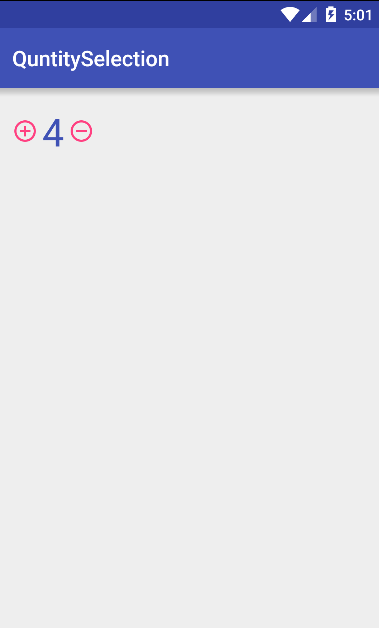

# Quantity Picker v1.0.1

This is an Android library, I call it Quantity Picker. It's very easy to use.
 . I hope that you will like it, and enjoys it. ^ ^
### Screenshots




```Maven

<dependency>
  <groupId>com.andanhm.quantitypicker</groupId>
  <artifactId>quantitypicker</artifactId>
  <version>1.0.1</version>
  <type>pom</type>
</dependency>
```

```Gradle

repositories {
    maven {
        url 'https://dl.bintray.com/andanhm3/maven'
    }
}

dependencies {
    compile 'com.andanhm.quantitypicker:quantitypicker:1.0.1'
}
```
If it doesn't work, please send me a email, andanhm3@gmail.com

####Or

Import the library, then add it to your `/settings.gradle` and `/app/build.gradle`
### License

It's very easy, just like this:
```xml
    <com.andanhm.quantitypicker.QuantityPicker
        xmlns:picker="http://schemas.android.com/apk/res-auto/"
        android:id="@+id/quantityPicker"
        picker:minQuantity="1"
        picker:maxQuantity="5"
        picker:quantityColor="@color/colorPrimary"
        picker:buttonColor="@color/colorAccent"
        android:layout_width="wrap_content"
        android:layout_height="wrap_content"/>
```

```java
        QuantityPicker quantityPicker = (QuantityPicker) findViewById(R.id.quantityPicker);

        //Returns the selected quantity
        quantityPicker.getQuantity();

        //Allows to set the minimum quantity
        quantityPicker.setMinQuantity(1);

        //Allows to set the maximum quantity
        quantityPicker.setMaxQuantity(10);

        //Enable/Disable quantity picker
        quantityPicker.setQuantityPicker(true);

        //To set the quantity text color
        quantityPicker.setQuantityTextColor(R.color.colorPrimaryDark);

        //To set the quantity button color
        quantityPicker.setQuantityButtonColor(R.color.colorAccent);

        // Returns the quantity on quantity selection
        quantityPicker.setOnQuantityChangeListener(new QuantityPicker.OnQuantityChangeListener() {
            @Override
            public void onValueChanged(int quantity) {

            }
        });

```
Copyright 2015 Google, Inc.

Licensed to the Apache Software Foundation (ASF) under one or more contributor
license agreements. See the NOTICE file distributed with this work for
additional information regarding copyright ownership. The ASF licenses this
file to you under the Apache License, Version 2.0 (the "License"); you may not
use this file except in compliance with the License. You may obtain a copy of
the License at

http://www.apache.org/licenses/LICENSE-2.0

Unless required by applicable law or agreed to in writing, software
distributed under the License is distributed on an "AS IS" BASIS, WITHOUT
WARRANTIES OR CONDITIONS OF ANY KIND, either express or implied. See the
License for the specific language governing permissions and limitations under
the License.
```
